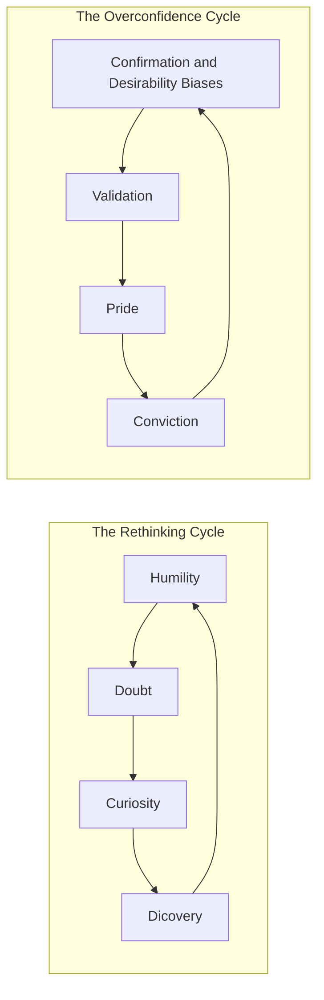
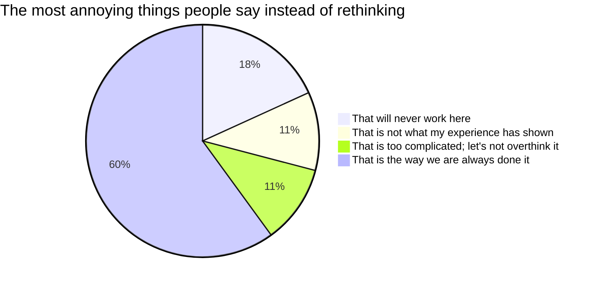
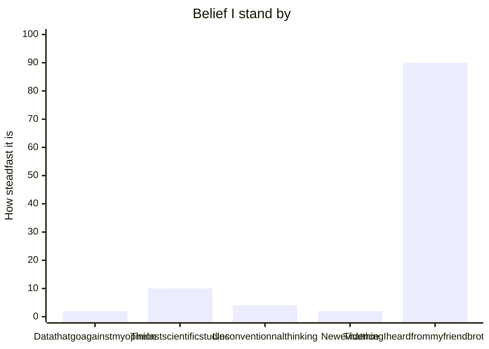

# Thing Again _by_ Adam Grant

## Prologue 

>This book is about the value of rethinking \[...\] about adopting the the kind of mental flexibility.

## Chapter 1: A preacher, a prosecutor, a politician and a scientist walk into your mind 

> Progess is not possible without change ; and those who can not change there mind can note change anything.
(George Bernard Shaw)

> Two decades ago my collegues Phil Tetlock discovered something peculiar. As we think and talk, we often slip into the mindsets of three different professions : preachers, prosecutors, and politicians. \[...\] We go into preacher mode when our sacred beliefs are in jeopardy: we deliver sermons to protect and promote our ideals. We enter prosecutor mode when we recognize flaws in other people's reasoning: we marshal arguments to prove them wrong and win ou case. We shift into politician mode when we're seeking to win over an audiance: we campaign and lobby for the approval of our constituents. The risk is that we become wrapped up in preaching that we're right, prosecuting others who are wrong, and politicking for support that we don't bother to rethink our own views.

> In psychology there are at least two biases that drives this pattern.
> 1. One is confirmation bias: seeing what we expect to see.
> 2. The other is desirability bias: seeing what want to see.
> 
> These biases don't just prevent us from applying our intelligence. They can actually confort our intelligence into a weapon against the truth. \[...\] The tragedy is that we are usually unaware of the resulting flaws in ou thinking.

> Visions of change are more compelling when they include visions of continuity. Although our strategy might evolve, our identity will endure.

> The opposite of armchair quaterback syndrome is the impostor syndrome, where competence exceeds confidence.

> They found that in many stiuations, those who can't ... don't know they can't. According to what's now known as the Dunning-Kruger effect, it is when we lack competence that we're most likely to be brimming with overconfidence.

## Chapter 2: The armchair quaterback and the impostor 

> Arrogance leaves us blind to our weaknesses. Humilyt is a reflective lens: it helps us see them clearly. Confidence humility is a corrective lens: it enables us to overcome thos weeknesses.

## Chapter 3: The joy of being wrong

> "Being wrong is the only ay I feel I've learned something."

## Chapter 4: The good fight club

>

## TEST : to be deleted 

