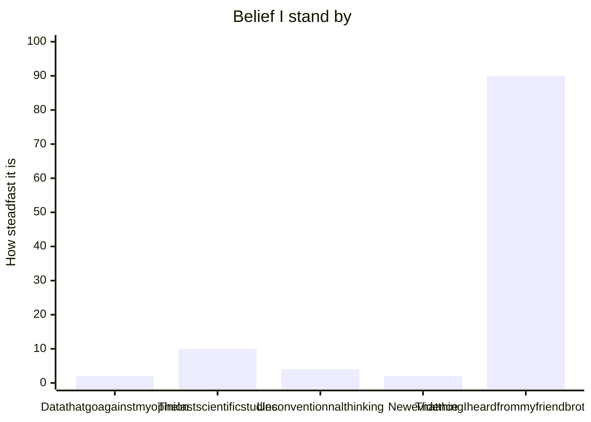

# Thing Again _by_ Adam Grant

## Prologue 

>This book is about the value of rethinking \[...\] about adopting the the kind of mental flexibility.

## Chapter 1 : A preacher, a prosecutor, a politician and a scientist walk into your mind 

> Progess is not possible without change ; and those who can not change there mind can note change anything.
(George Bernard Shaw)

## TEST : to be deleted 

