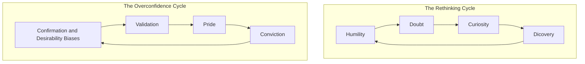
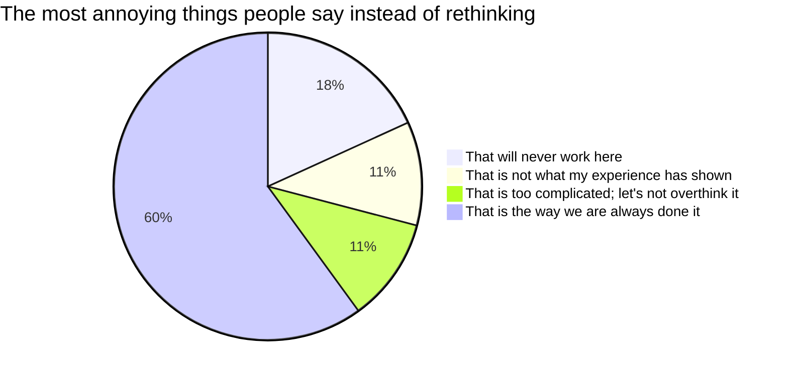
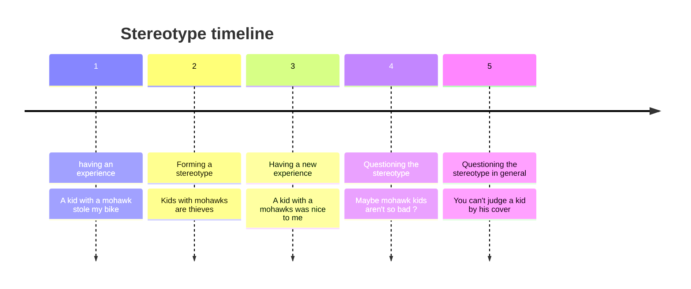
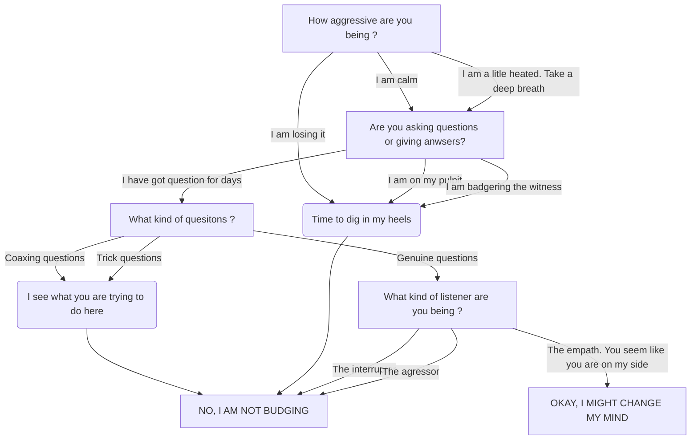

# Thing Again _by_ Adam Grant

## Prologue 

>This book is about the value of rethinking \[...\] about adopting the the kind of mental flexibility.

## Chapter 1: A preacher, a prosecutor, a politician and a scientist walk into your mind 

> Progess is not possible without change ; and those who can not change there mind can note change anything.
(George Bernard Shaw)

> Two decades ago my collegues Phil Tetlock discovered something peculiar. As we think and talk, we often slip into the mindsets of three different professions : preachers, prosecutors, and politicians. \[...\] We go into preacher mode when our sacred beliefs are in jeopardy: we deliver sermons to protect and promote our ideals. We enter prosecutor mode when we recognize flaws in other people's reasoning: we marshal arguments to prove them wrong and win ou case. We shift into politician mode when we're seeking to win over an audiance: we campaign and lobby for the approval of our constituents. The risk is that we become wrapped up in preaching that we're right, prosecuting others who are wrong, and politicking for support that we don't bother to rethink our own views.

> In psychology there are at least two biases that drives this pattern.
> 1. One is confirmation bias: seeing what we expect to see.
> 2. The other is desirability bias: seeing what want to see.
> 
> These biases don't just prevent us from applying our intelligence. They can actually confort our intelligence into a weapon against the truth. \[...\] The tragedy is that we are usually unaware of the resulting flaws in ou thinking.





> Visions of change are more compelling when they include visions of continuity. Although our strategy might evolve, our identity will endure.

> The opposite of armchair quaterback syndrome is the impostor syndrome, where competence exceeds confidence.

> They found that in many stiuations, those who can't ... don't know they can't. According to what's now known as the Dunning-Kruger effect, it is when we lack competence that we're most likely to be brimming with overconfidence.

## Chapter 2: The armchair quaterback and the impostor 

> Arrogance leaves us blind to our weaknesses. Humilyt is a reflective lens: it helps us see them clearly. Confidence humility is a corrective lens: it enables us to overcome thos weeknesses.

## Chapter 3: The joy of being wrong

> "Being wrong is the only ay I feel I've learned something."

## Chapter 4: The good fight club

> Relationship conflict is destructive in part because it stand in the way of rethinking. When a clash gets personal and emotional, we become self-righteous preachers of our own views, spiteful prosecutor of the other side, or single-minded politicians who dimiss opinions that do not come from our side. Task conflict can be contructive when it brings diversity of thought, preventing us from getting trapped in overconfidence cycles. It can help us stay humble, surface doubts, and make us curious about what we might be missing. That can lead us to think again, moving us closer to the truth without domaging our relationships.

> Disagreable givers often make the best critics: their intent is to elevate the work, not feed their own egos. They don't criticize because they're insecure; they challenge because they care. They dish ou tough love.

```mermaid
%%{init: {"flowchart": {"htmlLabels": false}} }%%
---
title how task conflict can turn into relationship conflict
---
flowchart LR
    subgraph At work
        A["Did you get my email ?"]
        B["I haven't gotten a chance to read it"]
        C("Under breath : I hate you")
        A-->B-->C
    end
    subgraph At school
        D["How are we getting to the party ?"]
        E["I don't know, I always drive."]
        F["You don't have to say it like that."]
        G("Cool, I am going without you then")
        D-->E-->F-->G
    end
    subgraph At home
        H["What should we eat tonight ?"]
        I["I don't care, you choose."]
        J("Ugh, you alwais do this.")
        H-->I-->J
    end
```

> A disagreement feels personal and potentially hostile; we experct a debate to be about ideas, not emotinos. Starting a disagreement by asking, "Can we debate?" sends a message that you want to think like a scientist, not a preacher or a prosecutor-and encourages the other person to think that way, too.

> Social scientists asked people why they favor particular policies on taxes, health care, or nuclear sancitons, they often doubted down on their convictions. Asking popole to explain _how_ \[(not why)\] those policies would work in practice-or how they would explain them to an expert-activated a rethinking cycle. They noticed gaps in their knowledge, doubted their conclusions, and became less extreme; they were now more curious about alternative options.

## Chapter 5: Dance with foes 

> In a formal debate you goal is to change the mind of your audiance. In a informal debate, you're trying to change the mind of your conversation partner.

What skilled negotiators do differently 
|| Average negotiators | Skilled negotiators |
|-|-|-|
|Commun ground | 11% | 38% |
|Number of reasons | 30% | 18%|
|Defend-attack spirals | 6,3% | 1,9%|
|questions | 9,6% | 21,3|

> Harish accepted that the point was valid, which allowed him to relate to his opponent's perpective - and to the audience's. Then it was perfectly fair and balanced for him to express his concerns about whether a subsidy would git the most underprivileged kids access to preschool.

> If you have too many arguments, you'll dilute the power of each and every one.

> When someone becomes hostile, if you respond by viewing the argument as a war, you can either attack or retreat. If instead you treat it as a dance, you have another option-you can sidestep. Having a conversation about the conversation shifts attention away from the substance of the disagreement and toward the process for having a dialogue.

## Chapter 6: Bad blood on the diamond

> Socially, there is another reason stereotypes are so sticky. We tend to interact with people who share them, which makes them even more extreme. This phenomenon is called group polarization, and it is been demonstrated in hundreds of experiments.



> A key step is getting them to do some counterfactual thinking: helping them considerer what they would believe if they were living in an alternative reality.

# Chapter 7: Vaccine whisperers and mild-mannered interrogators

> Together, they developed the core principales of a practice called _motivational interviewing_. The central premise is that we can rarely motivate someone else to change. We're better off helping them find their own motivation to change.

> The process of motivational interviewing involves three key techniques :
> 1. Asking open-ended questions
> 2. Engaging in reflective listening
> 3. Afirming the person's desire and ability to change

> Before Marie-Hélène left the hospital, she had Tobie vaccined. A key turning point, she recalls, was when Arnaud "told me that whether I chose to vaccinate or not, he respected my decision as someone who wanted the best for my kids. Just that sentence-to me, it was worth all the gold in the world".

Bad motivation Bingo 
| | | | | 
|-|-|-|-|
|Scare tactics | Withholding love | Telling me it is for my own good | Trying to make it seem like it was my idea |
| Yelling | Demeaning | Withholding support | lecturing |
| Manipulation | Not listening to what I have to say | Dismissing my feelings | Dismissing my ideas |
| Belittling me | Withholding respect | Passive-aggressiveness | Shaming|

> When we try to convince people to think again, our first instinct is usually to start talking. Yet, the most effective way to help others open their minds is often to listen.

> "Change talk is a golden thread", clinical psychologist Theresa Moyers says. "What you need to do is you need to pick that thread up and pull it."

> There is a _fourth technique of motivational interview_, which is often recommended for the end of a conversation and for transition points: summarizing. The idea is to explain your understanding of the other people's reasons for change, to check on whether you've missed or misrepresented anything, and to inquire about their plans and possible next steps.

> A guide does not stop at helping people change their beliefs or behaviors. Our work is not done until we've helped them accomplish their goals.



> Motivational interviewing requires a genuine desire to help people reach their goals.

> Eventually, when he understood Marie-Hélène's beliefs, Arnaud asked if he could share some information about vaccines based on his own expertise. "I started a dialogue", he told me. "The aim was to build a trusting relationship. If you present information without permission, no one will listen to you."

## Chapter 8: Charged conversations 

> To overcome binary bias, a good starting point is to become aware of the range of perpectives across a given spectrum. Polls suggest that on climate change, there are at least six camps of thought. Believers represent more than the half of Americans, but some are concerned while other are alarmed. The so-called nonbelievers actually range from cautious to disengaged to doubltful to dismissive.

Talking about charged topics : 
A triangle with: accurate, simple, well received at each vertew; and you can only choose 2 of them. 

> The greater the distance between us and an adversary, the more likely we are to oversimplify their actual motives and invent explanations that stray far from their reality. What works is not perspective-talking but perspective-seeking: actually talking to people to gain insight into the nuances of their views. That is what good scientists do: instead of drawing conclusions about people based on minimal clues, they test their hypotheses by strinking up conversations.

## Chapter 9: Rewriting the textbook

> This is part of a broader movement to teach kids to think like fact-checker: the guidelines includes (1) "interrogate information instead of simply consuming it", (2) "reject rank and popularity as a proxy for reliability" and (3) "understand that the sender of information is often not its source."

> It is not hard to see why a boring lecture would fail, but even captivating lectures can fall short of a less obvious, more concerning reason. Lectures are not designed to accommodate dialogue or disagreement, they turn students into passive receivers of information rather than active thinkers.

> This practice can extend far beyong the classroom. As we approach any life transition-whether it is a first job, a second marriage, or the third child-we can pause to ask people what they wish they had known before they went through that experience. Once we are on the other side of it, we can share what we ourselves should have rethought.

> When students confront complex problems, they often feel confused. A teacher's natural impulse is to rescue them as quickly as possible so that they do not feel lost or incompetent. Yet psychologists find that one of the hallmarks of an open mind is responding to confusion with curiosity and interest. one student put eloquently: "I need time for my confusion." Confusion can be a cue that there is new territory to be explored or a fresh puzzle to be solved. 

> The other format was a in-depth critique: for a single session, the class would focus on the work of one student or group. The authors would explain their goals and where they needed help, and Ron guided the calss through a discussion of strenghts and areas of development. He encouraged students to be specific and kind: to critique the work rather than the author. He taught them to avoir preaching and prosecuting: since they were sharing their subjective opinions, not objective assessments, they should say "I think" rather than "this is not good". He invited them to show humility and curiosity, framing their suggestions in terms of questions like "I'd love to hear why ..." and "Have you considered ..."

Judging yoursel VS. judging your work. 

## Chapter 10: That is not the way we have always done it

Psychological safety 
|When you have it|When you don't|
|-|-|
|See mistake as opportunities to learn | See mistake as threats to you career|
|Wiling to take risks and fail|Unwilling to rock the boat|
|Speaking your mind in meeting|keeping your ideas to yourself|
|Openly sharing you struggles|Only touting your strenghts|
|Trust in you teammates and supervisor|Fear of your teammates and supervisors|
|Sticking your neck out|Having your head chopped off|

> To combat that problem and nudge the culture toward learning, she started carrying a 3 x 5 note card in her pocket with questions to ask about evey launch \[NASA\] and important operational decision. Her list included :
> 1. What leads you to that assumption ? Why do you think it is correct ? What might happen if it is wrong ?
> 2. What are the uncertainties in you analysis ?
> 3. I understand the advantage of you recommendations. What are the disadvantages ?

> It is nonjudgmental-a straightforward expression of doubt and curiosity that does not put peaple on the defensive.

> The standard advice for managers on building psychological safety is to model openness and inclusiveness. Ask for feedback on how you can improve, and people will feel safe to take risks.

> Constructive criticism.

> Instead of asking them to seek feetback, we had randomly assigned those managers to share their past expersiences with receiving feadback and their fuure development goals.

> By admintting some of their imperfections out loud, managers demonstrated that they could take it-and made a public commitment to remain open to feedback. They normalized vulnerability, making their teams more confortable opening up about their own struggles. Their employees gave more useful feedback because they knew where their managers were working to grow.

> Amy Edmondson finds that when psychological safety exists without accountability, people tend to stat within their confort zone, and when there is accountability but not safety, people tend to stay silent in an anxiety zone. When we combine both, we create a learning zone. People feel free to experiment-and to poke holes in one another's experiments in service of making them better. They become a challenge network.

> In the emerging learning culture, "it is not just that we are encouraged to speak up. It is our responsability to speak up," she explains. "Inclusion at NASA is not only a way to increse innovation and engage employee; it directly affects safety since people need to feel valued ans respected in order to be confortable speaking up."

> In the past the onus would have been on her to prove it was not safe to launch. Now the onus was ont the team to prove is was safe to launch.

## Chapter 11: Escaping tunnel vision

> Ryan escalated his commitment to medical training for sixteen years. If he had been less tenacious, he might have changed tracks sooner. Early on, he had fallen victim to what psychologists call _identify foreclosure_-when we settle prematurely on a sense of self without enought du deligence, and close our minds to alternative selves. 

> "I think it is one of the most useless question an adult can ask a child," Michelle Obama writes. "What do you want to be when you grow up ?" As if growing up is finite. As if some point you become something and that is the end.

> Just as an appointment with the doctor \[...\] I encourage them to put a reminder in their calendars to ask some key questions twice a year. When did you form the aspirations you are currently pursuing, and how have you changed since then ? Have you reach a learning plateau in your role or you workplace, and is it time to consider a pivot ? Answering these career checkup questions is a way to periodically activate rethinking cycles.

> It is our actions-not our surroundings- that bring us meaning and belonging. 

## Epilogue 

> "What I believe" is a process rather than a finality. (Emma Goldman)

## Action for impact 

> 1. Individual Rethinking
>    1. Develop the habit of thinking again
>        1. Think like a scientist
>        2. Define your identity in terms of values, not opinions.
>        3. Seek out information that goes against you views
>    2. Calibrate your confidence
>       1. Beware of getting stranded at the summit of Mount Stupid. Do not confuse confidence with competence.
>       2. Harness the benefits of doubt. \[...\] reframe the situation as an opportunity for growth.
>       3. Embrase the joy of being wrong.
>    3. Invite others to question you thinking
>       1. Learn something new from each person you meet.
>       2. Build a challenge network, not just a support network.
>       3. Don't shy away from constructive conflict.
> 2. Interpersonal rethinking
>    1. Ask better questions
>       1. Practice the art of persuasive listening. \[...\] uncover their own reasons for change.
>       2. Question how rather than why.
>       3. Ask "what evidence would change you mind ?"
>       4. Ask how people originally formed an opinion.
>    2. Approach Disagreements as Dances, not battles
>       1. Acknowledge common ground.
>       2. Remember that less is often more.
>       3. Reinforce freedom of choice. \[...\] It is up to them to choose what they believe. 
>       4. Have a conversation about the conversation. If emotions are running hot, \[...\] you can sometimes make progress by expressing your disappointment or frustration and asking people if they share it.
> 3. Collective rethinking
>    1. Have more nuanced conversations
>       1. Complexify contentious topics. There are more than two sides to every story.
>       2. Do note shy away from caveats and contingencies.
>       3. Expand your emotional range.
>    2. Teach kids to think again
>       1. Have a weekly myth-busting dicussion at diner.
>       2. Invite kids to multiple drafts and seek feedback from others.
>       3. Stop asking kids what they want to be when they grow up.
>    3. Create learning organizations
>       1. Abandon best practices. \[...\] continually striving for better practices.
>       2. Establish psychological safety.
>       3. Keep a rethinking scorecard.
>    4. Stay open to rethinking your future
>       1. Throw out the ten-year plan
>       2. Rethink your actions, not just your surroundings.
>       3. Schedule a life checkup
>       4. Make time to think again
